# Helix Trading Assistant

<p align="center">
  
</p>

A native **macOS and iPad** app for studying gold, oil, crypto, and index
markets: live multi-source price feeds, a deep technical-indicator suite
built around smart-money concepts (order blocks, fair value gaps, volume
profile), on-chart position planning with correct lot sizing, a trade
journal with AI reviews, and AI market analysis driven by the local
`claude` / `codex` / `opencode` CLIs. Built in SwiftUI on Apple Charts and
GRDB — no Electron, no web view, no server.

> **⚠️ Not financial advice.** Helix Trading Assistant is a personal-use
> research tool. The AI engines generate trade ideas and plans from market
> snapshots; nothing here is investment advice, and no trades are placed
> against a live broker — the auto-trader is paper-only. Use at your own
> risk.

---

## What the app is

Helix is organised as one **Dashboard** (the chart) surrounded by
supporting rooms:

| Screen | What it does |
|---|---|
| **Dashboard** | The chart: candles, indicators, drawings, positions, replay, alerts, AI analysis. Split into a 2- or 4-pane grid, each pane with its own pair/timeframe/indicators. |
| **News** | ForexFactory economic calendar filtered by impact; events also plot as flags on the chart's time axis. |
| **Portfolio** | Paper balance and open/closed trade P&L from the auto-trader sandbox. |
| **Journal** | Multiple trade logs (e.g. "Prop challenge", "Personal", "Backtests"), each with win rate and P&L, per-trade AI post-mortems, and day/week/month AI reviews. Imports broker statement CSVs. |
| **Inbox** | Every alert the app fires — price, indicator, order-block lifecycle — in one filterable history with unread badges. |
| **Settings** | Data sources, AI engines, proxy, auto-trader, notifications, in-app updates. |

**Symbols out of the box:** XAU/USD (gold), WTI crude, BTC, ETH, SOL,
Dow Jones, US Dollar Index. Prices stream from Yahoo Finance, a TwelveData
WebSocket, and a Faraz source for WTI/DXY; history is stored in SQLite via
GRDB, so the chart works on years of 1-minute data offline.

---

## The chart

- **Candle, line, or Heikin Ashi**, on a bar-index X axis so weekend gaps
  don't tear holes in the series.
- **Pan / pinch-zoom / axis scaling**, with the visible window rendered
  and decimated for speed — years of 1m bars stay smooth.
- **Replay mode** — pick an anchor bar and step the market forward
  bar-by-bar to practice setups.
- **Multi-chart grid** — 2 or 4 independent panes, optional symbol sync,
  per-pane fullscreen.
- **Drawing tools** — horizontal line, trend line, rectangle, Volume
  Profile box, and long/short **positions** (below). Drawings anchor to
  dates, so they survive timeframe switches, and can be placed *ahead* of
  price in the chart's right margin. Select one to recolor, restyle, or
  drag any handle.

### Position tool

Drop a **Long** or **Short** position on the chart — TradingView style:

- Drag height sets the initial stop distance; the target defaults to 2R.
- Drag the **entry** (price + time), **stop**, **target**, or the **right
  edge** (time extent) independently.
- Every position carries its own **account balance and risk %**, editable
  in the floating inspector.
- The label shows the computed **lot size, risk $, reward $, and R:R**
  live while you drag, and warns when the size falls below the broker
  minimum.
- Lot math runs through per-instrument **contract specs** (gold = 100 oz,
  WTI = 1,000 bbl, crypto = 1 coin, …) so each symbol sizes correctly —
  the same engine behind the Risk Calculator popover.

---

## Indicators

All indicators are **multi-instance**: add several copies with different
parameters, toggle visibility per instance, and tune everything in a
floating settings panel. Overlays render on the price chart; oscillators
get their own sub-panes.

### Classic

| Indicator | Notes |
|---|---|
| **SMA / EMA** | Any length, any number of instances. |
| **Bollinger Bands** | Length + multiplier. |
| **UT Bot** | ATR trailing-stop flip signals, optional Heikin Ashi source. |
| **RSI, MACD, Stochastic** | Oscillator pane with configurable lengths. |
| **Ichimoku Cloud** | Full five-line system with filled Kumo, all lengths and displacement tunable. |
| **ZigZag** | Swing-pivot polyline; depth + minimum-change filters. |

### Smart-money / order-flow

| Indicator | Notes |
|---|---|
| **Order Blocks** | Base detector with a full **exhaustion lifecycle**: fresh → tested → exhausted with a retest counter, optional notifications on appear/retest/exhaust. |
| **Steroid Order Blocks** | Volume-validated: a zone only survives if its origin candle beats its 20-period average volume or overlaps a high-volume node. |
| **Sonarlab Order Blocks** | Port of the Sonarlab detector with its sensitivity + mitigation options. |
| **Ranked Order Blocks** | Swing-structure blocks graded **A/B/C** by two confluences: Volume Profile (does the zone sit on a high-volume node?) and Ichimoku (position vs the cloud + Tenkan/Kijun agreement). Breaker lifecycle and overlap merging; the badge shows grade + score, e.g. "A 4/5". |
| **Ichimoku-confluence Order Blocks** | Base blocks kept only where they agree with the Ichimoku picture (Kijun/Tenkan/Kumo overlap, cloud trend). |
| **Volume-Filtered Order Blocks** | Swing-anchored zones with a volumetric **up/down split + balance %**, ATR size filter, breaker lifecycle, and same-direction zone merging. |
| **Fair Value Gaps** | Three-candle imbalance zones with mitigation tracking. |
| **Change of Character (CHoCH)** | Structure-shift zones with OB/FVG confluence, including **higher-timeframe zones projected onto the current timeframe**. |
| **Volume Profile** | Three modes: per-trading-day sessions (anchored 18:00 ET), the last ZigZag trend segment, or visible-range with ranked high-volume levels. Two-tone up/down buckets, POC, and value-area high/low. Also available as a drag-anywhere drawing. |
| **Trading Sessions** | Asia / London / New York boxes with session high/low. |

### Strategy overlays

Close-confirmed setups that paint entries, stops, and targets directly on
the chart, each with unit tests:

- **NY Open Setup** — the New York open range play.
- **SP2L** — session-pivot two-leg continuation.
- **Pin Bar Combo / BTB** — pin-bar cluster reversals.
- **MicroMap** — micro structure map of local highs/lows.
- **MTR** — major trend reversal detection.

---

## AI features

The AI engines run as **local subprocesses** — the app writes a prompt to
stdin and parses streaming output. No API keys are stored in the repo.

- **Engines:** Claude Code CLI (reuses your existing Claude session),
  OpenAI Codex CLI, or OpenCode (local, or pointed at your own remote
  OpenCode server — the iPad build uses remote OpenCode).
- **Full TA** — scenario, bias, key levels, and a trade plan from a
  bundled market snapshot.
- **Support / Resistance** — returns structured `LEVELS_JSON`, plotted
  straight onto the chart as horizontal lines.
- **Fair Value Gaps** — `FVG_JSON` zones drawn as shaded rectangles.
- **Multi-Timeframe** — four timeframes bundled into one confluence
  prompt.
- **Journal reviews** — per-trade post-mortems plus whole day/week/month
  reviews with OHLC context; history is persisted and browsable.
- **Auto-trader (paper only)** — reacts to AI scenarios with risk-%
  sized paper trades, tracks P&L against a paper balance, enforces safety
  gates (news blackouts, loss cooldowns, daily limits). No broker
  connection exists; nothing can place a real order.

---

## Alerts

- **Price alerts** — above/below lines drawn on the chart.
- **Indicator alerts** — RSI thresholds, UT Bot flips, order-block
  lifecycle events (appear / retest / exhaust), CHoCH shifts.
- Everything lands in the **Inbox** with unread badges and the
  triggering timeframe, and optionally in macOS Notification Center.

---

## How it works

```
                                                ┌──────────────────────────┐
   Yahoo Finance ──────────┐                    │  Helix Trading.app       │
   TwelveData WS ──────────┤  Fetching/         │                          │
   Faraz (WTI, DXY) ───────┤  ─────────────►    │  ┌────────────────────┐  │
   ForexFactory calendar ──┘                    │  │  GRDB SQLite       │  │
                                                │  │  ohlc, snapshots,  │  │
                                                │  │  alerts, journal   │  │
                                                │  └────────────────────┘  │
                                                │                          │
                                                │  Apple Charts            │
                                                │  + Indicators            │
                                                │                          │
                                                │  ┌────────────────────┐  │
   ~/.claude/bin/claude  ◄── stdin/stdout ───── │  │ AI/ClaudeEngine    │  │
   ~/.local/bin/codex    ◄── stdin/stdout ───── │  │ AI/CodexEngine     │  │
   opencode (local/remote) ◄── stdin/HTTP ───── │  │ AI/OpenCodeEngine  │  │
                                                │  └────────────────────┘  │
                                                └──────────────────────────┘
```

- **Fetching** (`GoldMonitorMac/Fetching/`) — concurrent HTTP / WebSocket
  sources, each independently retryable. Results land in GRDB.
- **Scheduling** (`GoldMonitorMac/Scheduling/`) — `YahooScheduler` (10s
  ticks + history bootstrap), Faraz WS, snapshot fetchers.
- **Storage** (`GoldMonitorMac/Storage/`) — `GRDB.DatabasePool` under
  `~/Library/Application Support/HelixTrading/`. Writes serialise; reads
  parallelise.
- **Indicators** (`GoldMonitorMac/Features/Dashboard/`) — pure functions
  over `[Candle]`, memoized per-pane in `ChartDerivedCache` so pan/zoom
  never recomputes.
- **AI engines** (`GoldMonitorMac/AI/`) — spawn the local CLI binary as a
  subprocess and stream its output. No HTTP, no keys in the codebase.
- **UI** (`GoldMonitorMac/Features/`) — SwiftUI. Dashboard owns the chart;
  everything else is its own feature folder.

See [`AGENTS.md`](AGENTS.md) for the detailed architecture notes,
persistence patterns, and contributor gotchas — it is the single working
brief for this repository.

---

## Requirements

| What | Why | How `./run.sh` handles it |
|---|---|---|
| **macOS 13+** | Apple Charts baseline | — |
| **Xcode 15+** | Swift 5.9, SwiftUI compiler | Manual (App Store) |
| **Homebrew** | for `xcodegen` + `node` | Auto-installed if missing |
| **xcodegen** | regenerates `.xcodeproj` from `project.yml` | `brew install xcodegen` |
| **Node.js + npm** | required by the Claude / Codex / OpenCode CLIs | `brew install node` |
| **`claude` CLI** | drives Claude Code engine | `npm i -g @anthropic-ai/claude-code` |
| **`codex` CLI** *(optional)* | drives the Codex engine | `npm i -g @openai/codex` |
| **`opencode` CLI** *(optional)* | drives the OpenCode engine (or point it at a remote server) | `npm i -g opencode-ai` |
| **TwelveData API key** *(optional)* | live crypto stream (free tier OK) | Wizard, on first launch |

You only need **Xcode + Homebrew** to start. `./run.sh` bootstraps the rest.

---

## Quick start

```bash
git clone git@github.com:pouyaam/HelixTradingAssistant.git
cd HelixTradingAssistant
./run.sh
```

The script verifies (and installs if needed) Homebrew, xcodegen, and
Node.js, installs the AI CLIs, regenerates the Xcode project from
`project.yml`, builds, and launches. On first launch the **setup wizard**
walks you through detecting the `claude` binary and entering your
TwelveData key (free tier at <https://twelvedata.com>). Re-run it any time
from **Settings → Run setup wizard**.

---

## iPad app

A native iPad target (`HelixTradingAppiPad`) shares the same data model,
indicator engines, and storage as the Mac app, with touch-sized drawing
handles and a `NavigationSplitView` shell.

```bash
# Simulator
./run.sh --ipad          # lists devices, pick one, build & run

# Real device (requires Apple ID in Xcode → Settings → Accounts)
DEVELOPMENT_TEAM=<your-team-id> ./run.sh --ipad
```

iPad specifics: only the selected pair syncs live data (saves CPU),
hidden grid panes skip loading entirely, and the AI engine is OpenCode in
remote mode — the Claude/Codex CLI engines are macOS-only.

---

## Manual build (without `run.sh`)

```bash
brew install xcodegen node
npm i -g @anthropic-ai/claude-code @openai/codex

xcodegen generate
open HelixTradingApp.xcodeproj   # then ⌘R in Xcode
```

Or from the CLI:

```bash
xcodebuild -project HelixTradingApp.xcodeproj -scheme HelixTradingApp \
  -configuration Debug -destination 'platform=macOS' build
```

## `run.sh` flags

```
./run.sh                # debug build, regen + build + launch
./run.sh --release      # release configuration
./run.sh --ipad         # list iPad devices, pick, build & run
./run.sh --dmg          # package a distributable .dmg (implies --release, no launch)
./run.sh --sign         # ad-hoc code-sign the .app before packaging (implies --dmg)
./run.sh --clean        # wipe ./build before building (forces SPM re-resolve)
./run.sh --no-launch    # build only, don't open the .app
./run.sh --quiet        # suppress xcodebuild noise
./run.sh --skip-deps    # don't try to install brew/npm tooling
```

DMG output lands in `./dist/HelixTradingApp-<version>.dmg`. The image is
ad-hoc signed at most — on another Mac the first launch requires
right-click → **Open**.

---

## Configuration

All user-configurable values live in **one** place:
[`GoldMonitorMac/App/DataSourceConfig.swift`](GoldMonitorMac/App/DataSourceConfig.swift),
persisted to `UserDefaults`. Secrets go into the **macOS Keychain** via
[`UI/KeychainHelper.swift`](GoldMonitorMac/UI/KeychainHelper.swift).
**There are no hardcoded keys in this repo** — the open-source build ships
empty and asks you to fill the wizard.

---

## Project layout

```
.
├── GoldMonitorMac/          # Swift sources (directory kept for git history;
│   ├── App/                 #   the bundle is "HelixTradingApp")
│   ├── AI/                  # AIEngine protocol, Claude/Codex/OpenCode engines
│   ├── Features/            # Dashboard, AIAnalysis, AutoTrader, Journal,
│   │                        # Alerts, Inbox, News, Portfolio, Settings,
│   │                        # Sidebar, Wizard
│   ├── Fetching/            # Yahoo, TwelveData, Faraz, ForexFactory, proxy
│   ├── Models/              # Candle, TradingPair, ContractSpec, calendar
│   ├── Scheduling/          # YahooScheduler, snapshot + news fetchers
│   ├── Storage/             # GRDB pool, schema, repos
│   └── UI/                  # Card, buttons, KeychainHelper
├── GoldMonitorMacTests/     # XCTest suite (indicators, setups, sizing)
├── ipadapp/                 # iPad-only views (shares the Mac sources)
├── Tools/                   # HelixIconGen.swift — regenerates app icons
├── project.yml              # xcodegen spec (source of truth for .xcodeproj)
├── run.sh                   # one-shot bootstrap / build / launch / package
├── dist/                    # built .dmg releases (gitignored)
├── AGENTS.md                # in-depth working brief for contributors
├── CLAUDE.md                # pointer to AGENTS.md
├── sessions/                # per-session work logs
├── LICENSE                  # MIT
└── README.md                # you are here
```

---

## Contributing

PRs welcome. Ground rules:

- **`project.yml` is the source of truth.** Don't commit `.xcodeproj/`;
  run `xcodegen generate` after changing it.
- **No new SPM deps without discussion.** Current deps are GRDB and
  swift-markdown-ui only.
- **macOS 13 / iOS 16 baseline.** No `@Observable`, no `symbolEffect`,
  no `chartScrollableAxes`. See [`AGENTS.md`](AGENTS.md) for the full
  gotcha list.
- **`xcodebuild build` before opening a PR** — and confirm the app
  launches.
- **No hardcoded secrets, ever.**

---

## License

[MIT](LICENSE) — see the file for details.

---

## Disclaimer

This software is provided "as is" for research and educational purposes
only. The author is not a registered financial advisor. Trade ideas
generated by the AI engines are based on technical patterns in price data
and **carry no guarantee of accuracy or profitability**. Past performance
does not predict future results. Trading carries risk of loss; you can
lose more than you deposit. Do your own research, manage your own risk,
and never trade with money you can't afford to lose.
